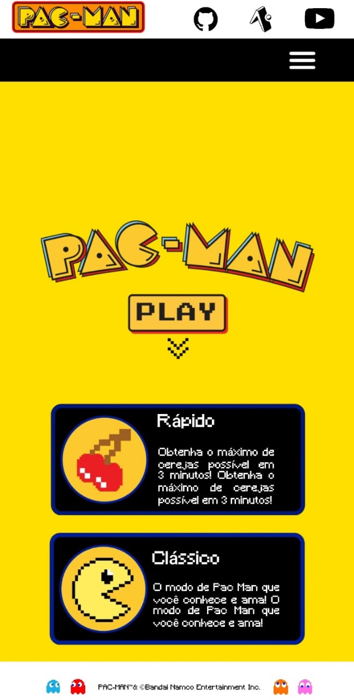

# 🟡 PAC MAN

Um dos maiores jogos da história, surgiu com a ideia de atrair o público feminino para o mundo dos games. Em homenagem ao Dia Internacional das Mulheres, produzimos um app sobre o Pac-Man.

# A aplicação

# 💻 Técnicas e Tecnologias
- Expo
- Componentes React Native
- Componentes customizados
- Suporte a telas
- Dafont
- StyleSheet

# 🖊 Pré-requisitos
Para visualizar a seguinte aplicação, realize os seguintes passos:

**PARTE 1**
Aqui mesmo no GitHub...
1. Clique no botão `Code`
2. Baixe o ZIP
3. Descompacte o arquivo

**PARTE 2**
Agora...
1. Abra uma conta no Expo Mobile. Comece por [aqui]( https://expo.dev/signup?redirect_uri=https%3A%2F%2Fsnack.expo.dev%2F%40beatrizsanti%2Fsnack-0%3FhideQueryParams%3Dtrue
) 
2. Clique em `New Snack`
3. Clique nos três pontinhos
4. Import files
5. Procure e selecione nos seus arquivos pelo código deste repositório
6. Clique em Launch Snack na lateral direita

# 💜 Sobre nós 💙
Somos uma dupla de estudantes do 2º ano de Análise e Desenvolvimento de Sistemas na FIAP (Faculdade de Informática e Administração Paulista). Com a proposta de produção de uma aplicação mobile, produzimos a seguinte página a fim de apresentar o jogo do Pac-Man e treinar as técnicas acima listadas.Criado por **Ana Luiza Fontes** e **Beatriz Santi**

